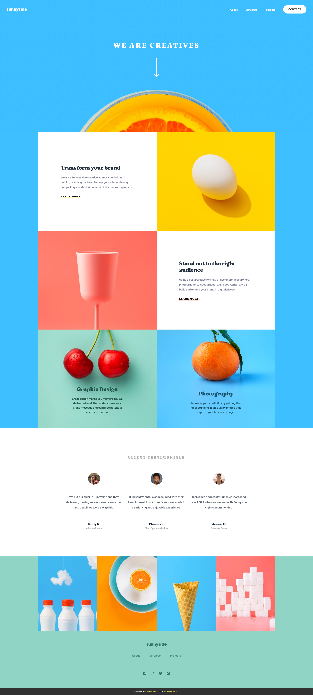

# Frontend Mentor - Sunnyside agency landing page solution

This is a solution to the [Sunnyside agency landing page challenge on Frontend Mentor](https://www.frontendmentor.io/challenges/sunnyside-agency-landing-page-7yVs3B6ef). Frontend Mentor challenges help you improve your coding skills by building realistic projects.

## Table of contents

- [Overview](#overview)
  - [The challenge](#the-challenge)
  - [Screenshot](#screenshot)
  - [Links](#links)
- [My process](#my-process)
  - [Built with](#built-with)
  - [What I learned](#what-i-learned)
- [Author](#author)

**Note: Delete this note and update the table of contents based on what sections you keep.**

## Overview

### The challenge

Users should be able to:

- View the optimal layout for the site depending on their device's screen size
- See hover states for all interactive elements on the page

### Screenshot

### Links

- Live Site URL: [Add live site URL here](https:elhuzain.github.io/sunnyside-agency)

## My process

### Built with

- Semantic HTML5 markup
- CSS custom properties
- Flexbox
- CSS Grid
- Mobile-first workflow
- [SASS](https://sass-lang.com/) - CSS library

### What I learned

This is my first project using SASS. It's been a long while since I built something using native tools as I've been heavily reliant on the powerful technologies (React.js, Next.js)

## Author

- Website - [Elhuzain](https://elhuzain.github.io/Portfolio)
- Frontend Mentor - [@ElHuzain](https://www.frontendmentor.io/profile/ElHuzain)
- Linkedin - [elhuzain](https://www.linkedin.com/in/elhuzain/)